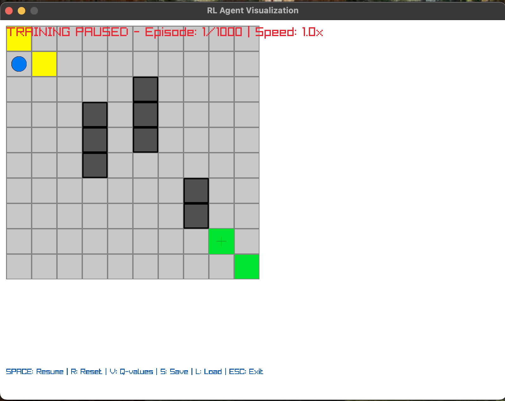
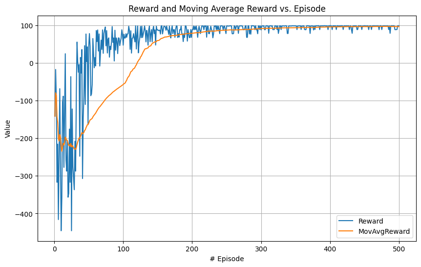

# Reinforcement Learning Grid World Simulation

A high-performance C implementation of Q-learning reinforcement learning algorithms with real-time visualization using Raylib. This project demonstrates advanced RL techniques including experience replay, state visit prioritization, and optimized Q-table operations for efficient training in grid-world environments.



## Overview

This simulation implements a comprehensive Q-learning agent that learns to navigate a 10x10 grid world from start position (1,1) to goal position (8,8) while avoiding walls and obstacles. The project features real-time visualization, interactive training controls, and advanced optimization techniques for enhanced learning performance.

## Core Features

### Reinforcement Learning Engine
* **Q-Learning Algorithm**: Classical temporal difference learning with configurable hyperparameters
* **Epsilon-Greedy Policy**: Balanced exploration-exploitation strategy with adaptive decay
* **Experience Replay Buffer**: Improves sample efficiency and training stability
* **State Visit Prioritization**: Prioritizes exploration of less-visited states
* **Optimized Q-Table Operations**: SIMD-accelerated operations for faster convergence

### Interactive Visualization
* **Real-Time Training Display**: Live visualization of agent learning process
* **Q-Value Heat Maps**: Visual representation of learned state values
* **Agent Path Tracking**: Trail visualization showing exploration patterns
* **Training Metrics**: Live statistics including reward, epsilon, and convergence metrics
* **Multiple Color Schemes**: Customizable visual themes for better clarity

### Advanced Optimizations
* **Experience Replay Buffer**: Stores and replays past experiences to improve learning stability
* **Priority State Visits**: Tracks state visitation frequency to encourage exploration
* **Q-Table Access Optimization**: Optimized memory access patterns and SIMD operations for faster training
* **Performance Monitoring**: Comprehensive metrics tracking for analysis and debugging

## Performance Results

The following graph shows training performance over 500 episodes, demonstrating convergence to optimal policy:



*The graph displays reward progression, success rate, and epsilon decay over training episodes using the `performance_data.csv` dataset.*

## Installation

### Prerequisites

* **C Compiler**: GCC or Clang with C99 support
* **Raylib**: Graphics library for visualization
* **Make**: Build system

### Setup

**macOS (Homebrew):**
```bash
brew install raylib gcc make
git clone https://github.com/jorgevee/Raylib-RL-Simulation.git
cd Raylib-RL-Simulation
make all
```

**Linux (Ubuntu/Debian):**
```bash
sudo apt-get update
sudo apt-get install build-essential libraylib-dev
git clone https://github.com/jorgevee/Raylib-RL-Simulation.git
cd Raylib-RL-Simulation
make all
```

### Build Commands

```bash
make all           # Standard build
make debug         # Debug build with symbols
make release       # Optimized release build
make clean         # Clean build artifacts
make test-all      # Run comprehensive test suite
```

## Usage

### Basic Training

```bash
# Standard training session
./bin/rl_agent --episodes 500

# Quick evaluation run
./bin/rl_agent --episodes 100 --max-steps 200
```

### Interactive Training with Visualization

```bash
# Full interactive experience
./bin/rl_agent --visualize --episodes 1000

# Custom training configuration
./bin/rl_agent --visualize --episodes 500 --max-steps 300 --policy-file my_policy.txt
```

### Command Line Options

| Option | Description | Default |
|--------|-------------|---------|
| `--episodes N` | Number of training episodes | 1000 |
| `--max-steps N` | Maximum steps per episode | 200 |
| `--visualize` | Enable real-time visualization | disabled |
| `--policy-file FILE` | Policy save filename | learned_policy.txt |
| `--no-save` | Disable automatic policy saving | false |
| `--quiet` | Suppress training output | false |

## Interactive Controls (with --visualize)

| Key | Function | Description |
|-----|----------|-------------|
| **SPACE** | Pause/Resume | Toggle training execution |
| **R** | Reset | Complete training restart with fresh Q-table |
| **V** | Q-values | Toggle Q-value visualization overlay |
| **+/-** | Speed Control | Adjust training speed (0.1x to 10x) |
| **S/L** | Save/Load | Save or load Q-table state |
| **ESC** | Exit | Terminate training session |

### Example Interactive Session

```bash
# Start interactive training
./bin/rl_agent --visualize --episodes 500

# During training:
# Press SPACE to pause and observe learned Q-values
# Press V to toggle Q-value heat map visualization  
# Press + to accelerate training, - to slow down
# Press S to save progress, L to load previous session
# Press R for complete reset, ESC to exit
```

## Example Commands

```bash
# Basic training
./bin/rl_agent --episodes 500

# Interactive training with visualization
./bin/rl_agent --visualize --episodes 1000

# Custom configuration
./bin/rl_agent --visualize --episodes 500 --max-steps 300 --policy-file my_policy.txt
```

The agent will train a Q-learning algorithm to navigate a 10x10 grid world from start (1,1) to goal (8,8), avoiding walls. Training progress and learned policy will be saved automatically.

## Technical Architecture

### Core Components

**Agent System (`src/agent.c`)**
* Q-learning implementation with configurable hyperparameters
* Experience replay buffer for improved sample efficiency
* Epsilon-greedy action selection with adaptive decay
* State-action value function approximation

**Environment System (`src/environment.c`)**
* Grid world implementation with customizable layouts
* Reward system: +100 (goal), -10 (wall), -1 (step)
* State space management and transition dynamics
* Episode management with configurable termination conditions

**Visualization System (`src/rendering.c`)**
* Real-time Raylib-based rendering engine
* Q-value heat map visualization
* Interactive control system
* Performance metrics display

**Optimization Layer (`src/q_table_optimized.c`)**
* SIMD-accelerated Q-table operations
* Optimized memory access patterns
* Experience replay buffer management
* State visit frequency tracking

### Memory Management

The system employs careful memory management with automatic cleanup:

```c
// Automatic resource management
QLearningAgent* agent = create_agent(num_states, num_actions, 0.1f, 0.95f, 1.0f);
GridWorld* world = create_grid_world(10, 10);
// ... training logic
destroy_agent(agent);
destroy_grid_world(world);
```

### Performance Optimizations

1. **Experience Replay Buffer**: Stores past experiences for batch learning updates
2. **State Visit Prioritization**: Encourages exploration of under-visited states  
3. **Q-Table Access Optimization**: SIMD operations and cache-friendly memory patterns
4. **Vectorized Operations**: Batch processing of Q-value updates for faster convergence

## Training Performance

The simulation tracks comprehensive metrics during training:

* **Episode Rewards**: Cumulative reward per episode
* **Success Rate**: Percentage of episodes reaching the goal
* **Step Efficiency**: Average steps to goal completion
* **Q-Value Variance**: Measure of policy convergence
* **Exploration Rate**: Epsilon decay over time

Performance data is automatically saved to `performance_data.csv` and `test_performance_data.csv` for analysis.

## Project Structure

```
c_raylib_simulation/
├── src/                       # Source implementation
│   ├── main.c                # Application entry point
│   ├── agent.c               # Q-learning agent implementation  
│   ├── environment.c         # Grid world environment
│   ├── rendering.c           # Raylib visualization
│   ├── q_table_optimized.c   # Optimized Q-table operations
│   └── utils.c               # Utility functions
├── include/                   # Header files
│   ├── agent.h               # Agent structures and APIs
│   ├── environment.h         # Environment definitions
│   ├── rendering.h           # Visualization interfaces
│   ├── q_table_optimized.h   # Optimization headers
│   └── utils.h               # Utility declarations
├── tests/                     # Comprehensive test suite
├── bin/                       # Compiled executables
├── build/                     # Build artifacts
├── Makefile                   # Build configuration
└── README.md                  # This documentation
```

## Contributing

Contributions are welcome! Please follow these guidelines:


### Development Workflow

```bash
# Development build with debugging
make debug

# Run comprehensive test suite  
make test-all

# Static analysis
make analyze

# Code formatting
make format
```

## License

This project is licensed under the MIT License. See the LICENSE file for details.

## Acknowledgments

Built with [Raylib](https://www.raylib.com/) graphics library for cross-platform visualization support.
